# 🔠 Strapi Superfields Plugin

## Enhance your components with super fields

This plugin adds list of new custom fields in strapi to make the content editing more comfortable

---

## 📦 Installation Guide

> 💡 **Note:**  
> If you simply run `npm install strapi-plugin-superfields`, it will install the version for **Strapi v5** by default.  
> To use this plugin with **Strapi v4**, make sure to install version `^4` explicitly.

---

📘 <strong>Installation by Strapi Version</strong>

 

| ⚙️ Strapi Version | 📦 Plugin Version                  | 🧪 npm Command                                       | 🧪 yarn Command                                      |
|------------------|-----------------------------------|------------------------------------------------------|-----------------------------------------------------|
| ✅ Strapi v5      | `strapi-plugin-superfields`       | `npm install strapi-plugin-superfields`             | `yarn add strapi-plugin-superfields`          |
| ⚠️ Strapi v4      | `strapi-plugin-superfields@^4` | `npm install strapi-plugin-superfields@^4`       | `yarn add strapi-plugin-superfields@^4`          |

---

## 🔗 Fields

- [Comment Field](#1-comment-field)
- [Tooltip Input Field](#2-tooltip-input-field)
- [Tooltip Number Input Field](#3-tooltip-number-input-field)
- [Boolean Field](#4-boolean-field)
- [Tooltip Enum Field](#5-tooltip-enum-field)
- [Tooltip Multi Select Field](#6-tooltip-multi-select-field)
- [Tooltip Date Time Picker Field](#7-tooltip-date-time-picker-field)
- [Tooltip Color Picker Field](#8-tooltip-color-picker-field)

---

Comment Field

### 1. Comment Field

✔️ Used to leave a comment in admin to inform about something
⚠️ The field is used as private and thus won't appear in api response, it is intended to be used only inside strapiu only

⚙️ Settings

- Name -- name of field
- Comment -- Content of the comment
- Color variant -- The color schema of the comment. Can be green (success), yellow (warn), red (error)

✅ Results this

Tooltip Input Field

### 2. Tooltip Input Field

✔️ This custom field allows you to display **tooltips** on input fields directly in the Content Manager.  
🎯 Tooltips help explain the purpose of a field, providing inline documentation and improving content editor usability.  
📌 Especially useful for onboarding editors or when fields require clarification about how values are used.

⚠️ This field is for **editorial use only** — tooltip messages are **not included in the API response**.

---

#### ⚙️ Field Configuration

Tooltip Input Field comes with multiple settings to customize how the help text appears:

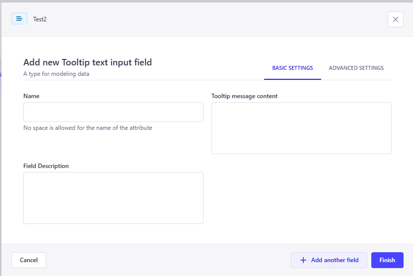

- **Name** – The visible label for the field
- **Description** – Optional small text under the input
- **Tooltip message** – The message shown in the tooltip (appears on hover)

---

#### ✅ How It Looks

Below is an example of how a tooltip field appears in the Content Editor:

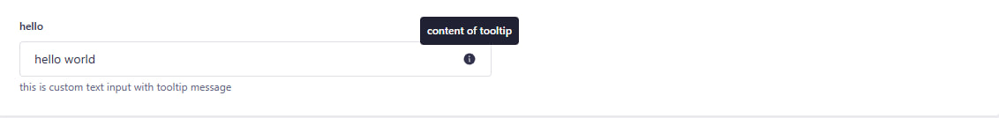

As you can see:

- The input field has a clear label and description
- A tooltip icon (`ⓘ`) shows contextual help when hovered
- This improves the clarity and usability of your Strapi admin panel

---

#### 🤔 Why Use Tooltip Input Field?

Tooltip Input Field let you:

- Guide editors without taking too much space
- Clarify business rules or formatting
- Improve content accuracy and consistency
- Reduce confusion for complex or optional fields

Tooltip Number Input Field

### 3. Tooltip Number Input Field

✔️ This custom field allows you to display **tooltips** on number input fields directly in the Content Manager.  
🎯 It helps explain the purpose of a numeric field, providing inline guidance and improving the user experience for content editors.  
📌 Especially useful when fields require specific formats or clarification.

⚠️ This field is for **editorial use only** — tooltip messages are **not included in the API response**.

---

#### ⚙️ Field Configuration

Tooltip Number Input Field provides flexible configuration options:

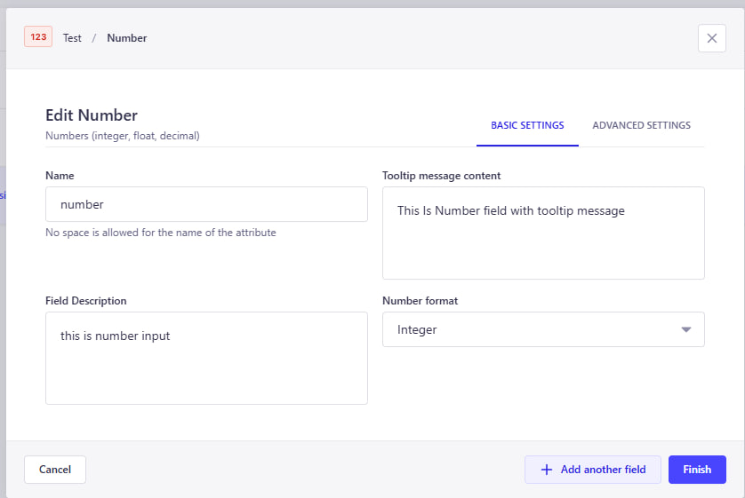

- **Name** – The name of the field (no spaces allowed)
- **Tooltip message content** – The message shown in the tooltip when hovering the (ℹ️) icon
- **Field Description** – Optional description shown under the input field

---

#### 🧠 Advanced Settings

Advanced options allow further validation and customization:

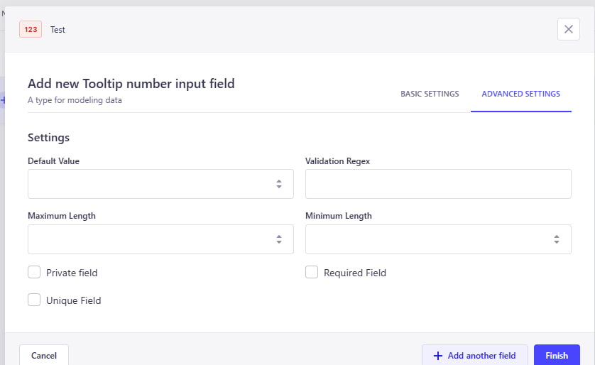

- **Default Value** – Predefined number to be used as the default input
- **Validation Regex** – Regular expression to validate specific numeric patterns
- **Maximum Length** – Maximum allowed character length for the input
- **Minimum Length** – Minimum character length required
- **Private Field** – Field is hidden from API responses and only visible in the admin panel
- **Required Field** – Field must be filled before submitting the form
- **Unique Field** – Ensures the value is unique across all entries

---

#### ✅ How It Looks

Here is how the Tooltip Number Input Field appears in the Content Editor:

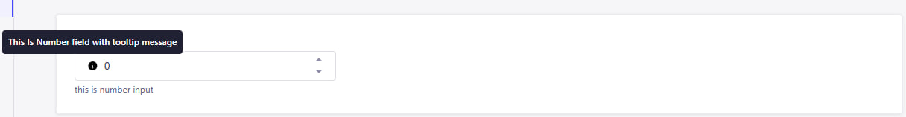

As shown above:

- The field is clearly labeled and displays a helpful tooltip
- A tooltip icon (`ⓘ`) shows contextual help on hover
- An optional description is displayed below the input box
- Default value can be pre-filled

---

#### 🤔 Why Use Tooltip Number Input Field?

Using this field can improve your content editing experience by:

- Providing contextual help for complex numeric fields
- Reducing errors and confusion for content editors
- Supporting validations to enforce rules
- Enhancing usability through better documentation directly in the form

Boolean Field

### 4. Boolean Field

✔️ This custom field allows you to add a boolean toggle (yes/no) switch to your content type.  
🎯 It’s useful for binary decisions like enabling/disabling features, flags, or simple true/false statuses.  
📌 Easily integrates into your content editing workflow without writing custom logic.

⚠️ This field supports API visibility control, validation, and advanced toggling logic.

---

#### ⚙️ Field Configuration

Boolean Field includes simple yet effective settings:

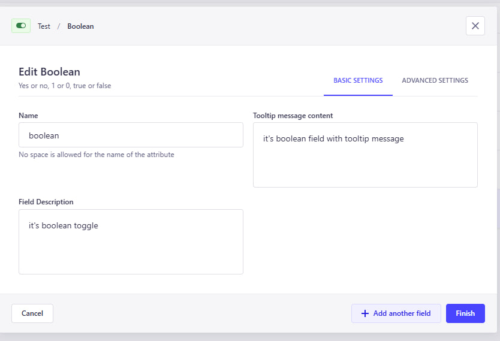

- **Name** – The name of the field (used in the API)
- **Label** – Display label in the admin panel
- **Description** – Optional explanation under the toggle
- **Default Value** – Set `true` or `false` as default state

---

#### 🧠 Advanced Settings

Fine-tune your boolean field with advanced options:

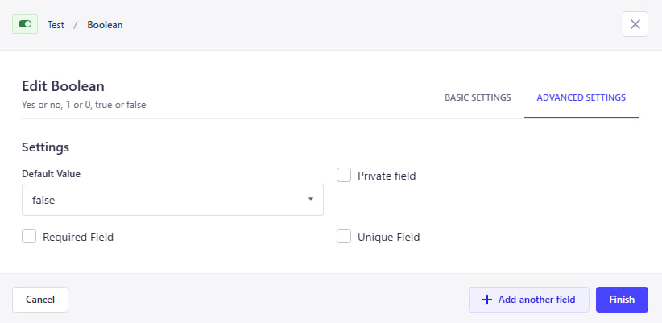

- **Default Setting** – Set `true` or `false` or `null` as default state
- **Private Field** – Hidden from API responses
- **Required Field** – Must be explicitly selected
- **Unique Field** – Ensure only one entry can have a specific value

---

#### ✅ How It Looks

Here's how the Boolean Field appears in the Content Editor:

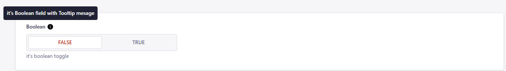

- The toggle appears as a simple switch
- Editors can enable or disable with one click
- Help text and default values improve UX

---

#### 🤔 Why Use Boolean Field?

Boolean Fields help you:

- Add clear yes/no options for editors
- Control feature toggles or flags easily
- Improve editor clarity with description + default value
- Simplify conditional logic in content workflows

Tooltip Enum Field

### 5. Tooltip Enum Field

✔️ This custom field allows you to define **enum values with tooltip support** directly in the Content Manager.  
🎯 Useful for selecting predefined options while providing inline guidance to editors.  
📌 Tooltips explain the purpose of the field and its options.

⚠️ This field is for **editorial use only** — tooltip messages are **not included in the API response**.

---

#### ⚙️ Field Configuration

The Tooltip Enum Field provides flexible configuration options:

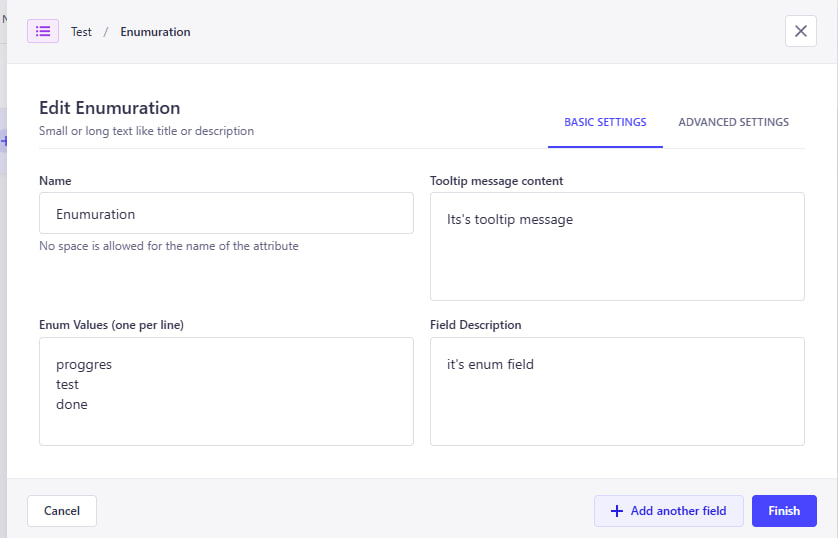

- **Name** – The name of the field (used in the API)
- **Enum Values** – List of values, one per line (e.g. `Draft`, `Published`, `Archived`)
- **Tooltip message content** – Message shown in the tooltip (ℹ️ icon)
- **Field Description** – Optional text displayed below the input
- **Default Value** – Select one of the enum values to use as default

---

#### 🧠 Advanced Settings

Additional options are available for validation and API behavior:

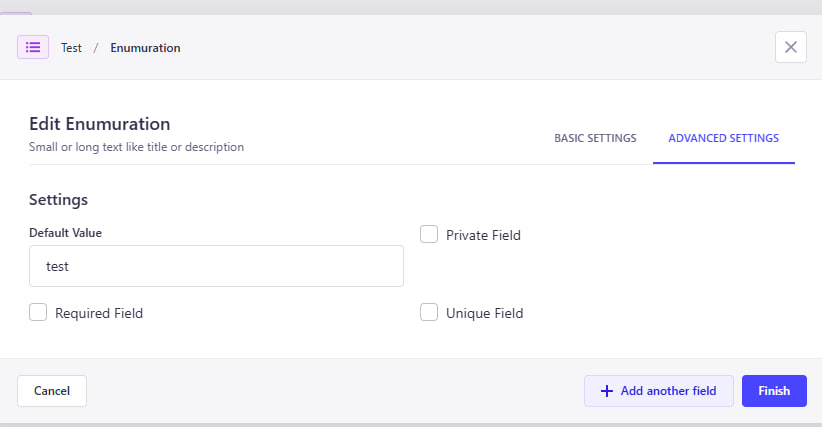

- **Private Field** – Field will be hidden in API responses
- **Required Field** – Field must be filled in before submitting the form
- **Unique Field** – Ensures the value is unique across all entries

---

#### ✅ How It Looks

Here’s how the Tooltip Enum Field appears in the Content Editor:

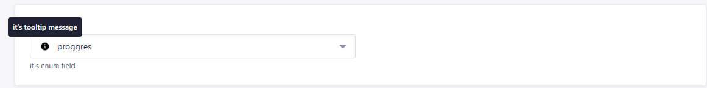

As shown above:

- The field has a clear label and optional description
- Tooltip icon (`ⓘ`) displays contextual help on hover
- Editors can select from predefined enum values

---

#### 🤔 Why Use Tooltip Enum Field?

Tooltip Enum Fields are great for:

- Making selection fields more informative
- Ensuring consistent value usage
- Helping editors understand field purpose at a glance
- Improving UX with tooltips and defaults

Tooltip Multi Select Field

### 6. Tooltip Multi Select Field

✔️ This powerful custom field combines **tooltip support** with various selection modes, giving editors a flexible and guided way to choose values.  
🎯 Depending on the selected mode, the field can behave as a **Multi Select**, **Single Select**, **Combobox**, or **Nested Multi Select**.  
📌 Especially useful when editors need structured selections while being guided with tooltips.

⚠️ This field is for **editorial use only** — tooltip messages are **not included in the API response**.

---

#### ⚙️ Field Configuration

The Tooltip Multi Select Field includes highly customizable options:

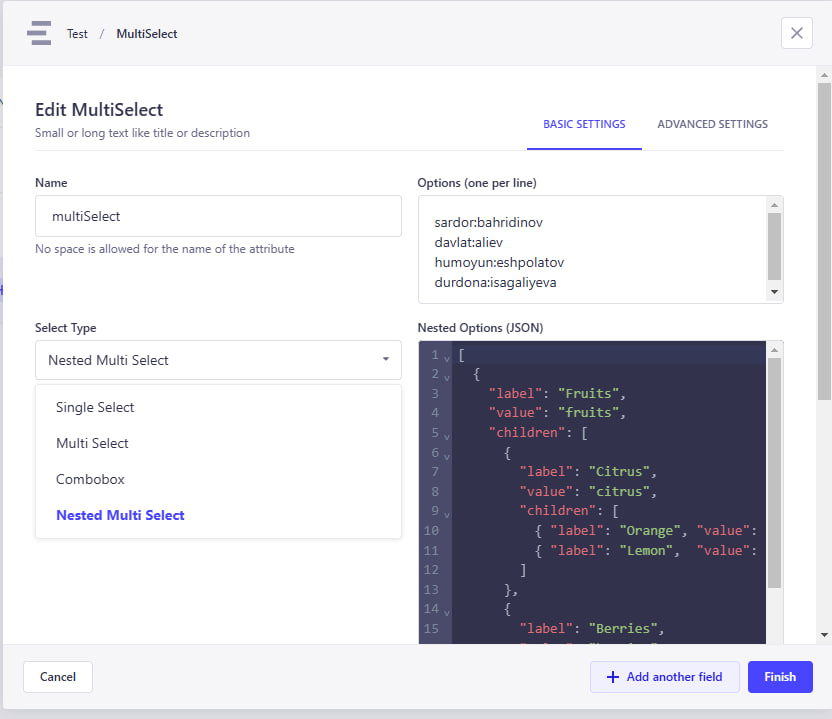

- **Name** – The name of the field (used in the API)
- **Select Type** – Defines how the input behaves. Options:
  - `multi-select`
  - `single-select`
  - `combobox`
  - `nested-multi-select`
- **Options List** – The values to choose from (simple list or nested tree, depending on the mode)
- **Tooltip Message** – Help text shown via tooltip (ℹ️ icon)
- **Field Description** – Optional description displayed under the input
- **Default Value** – One or more preselected values (based on mode)

---

#### 🧠 Advanced Settings

Take control over validation and visibility:

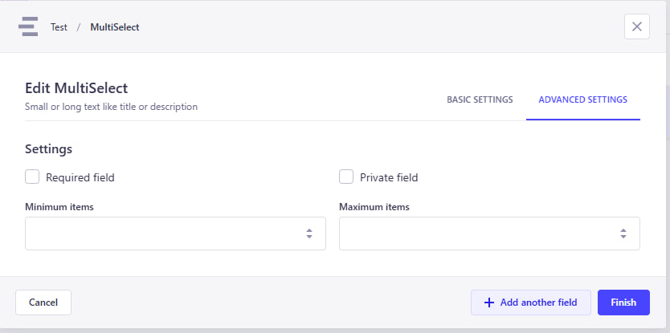

- **Private Field** – Field will be hidden in API responses
- **Required Field** – Must be filled before submission
- **Unique Field** – Ensures the selection is unique across all entries

---

#### ✅ How It Looks

Each select type adapts its UI accordingly in the Content Manager:

- `Multi Select` – Allows selecting multiple values
- `Single Select` – Dropdown with only one selectable value
- `Combobox` – Combines search + selection
- `Nested Multi Select` – Enables hierarchical selection from parent/child nodes

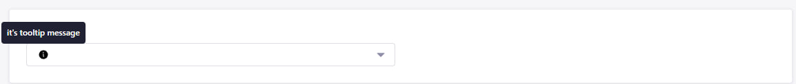

As shown:

- The field label, description, and tooltip make it editor-friendly
- Flexible input styles suit a variety of use cases

---

#### 🤔 Why Use Tooltip Multi Select Field?

This field is perfect for scenarios where editors:

- Need guided input with contextual help
- Must select from complex, structured options
- Require flexibility between single and multiple selection types
- Benefit from improved clarity via tooltips and inline documentation

Tooltip Date Time Picker Field

>### 7. Tooltip Date Time Picker Field

✔️ This custom field allows editors to **select date and time** with the help of tooltips and descriptions.  
🎯 Useful for scheduling content, setting deadlines, or storing event times — all while guiding users with contextual help.  
📌 Combines Strapi-friendly UX with rich configuration options.

⚠️ This field is for **editorial use only** — tooltip messages are **not included in the API response**.

---

#### ⚙️ Field Configuration

The Tooltip Date Time Picker includes intuitive configuration options:

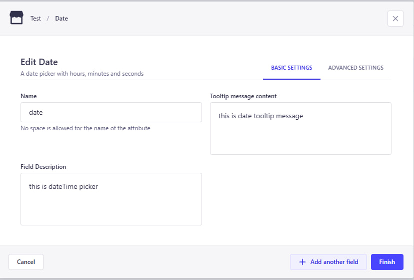

- **Name** – Field label shown in the admin panel  
- **Tooltip Message** – Contextual help shown via tooltip icon (ℹ️)  
- **Field Description** – Optional small text displayed under the input  
- **Default Value** – Optional default date/time value  

---

#### 🧠 Advanced Settings

You can enhance field behavior and validation with these advanced options:

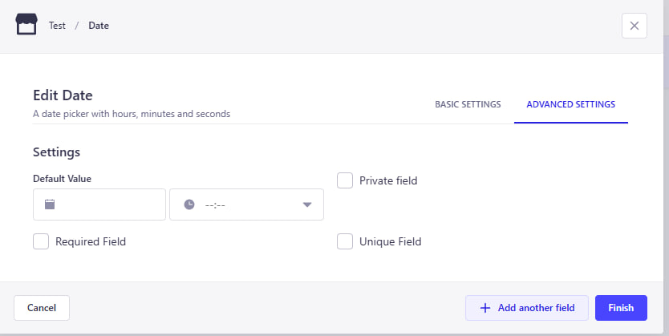

- **Private Field** – Will be hidden from API responses  
- **Required Field** – Must be filled before submitting the form  
- **Unique Field** – Ensures no duplicates across entries  

---

#### ✅ How It Looks

Here’s how the Tooltip Date Time Picker appears in the Content Editor:

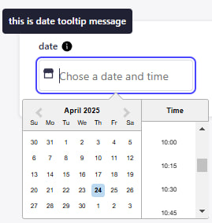

As you can see:

- The field includes a clear label and optional description  
- A tooltip icon (`ℹ️`) shows helpful info when hovered  
- A calendar + clock picker provides intuitive date/time selection  
- Default values and clearable input improve UX  

---

#### 🤔 Why Use Tooltip Date Time Picker?

This field is ideal when editors need to:

- Set future publish dates or deadlines  
- Choose times for scheduled events or reminders  
- Understand the meaning of the timestamp via tooltips  
- Improve accuracy with a calendar-based UI

Tooltip Color Picker Field

### 8. Tooltip Color Picker Field

✔️ This custom field allows editors to **select a color** from a predefined list or a color picker — with tooltip and description support.  
🎯 Perfect for selecting visual attributes like theme colors, status indicators, or branding elements.  
📌 It provides both a color name (e.g. `Primary`) and visual color swatch, improving clarity and usability for editors.

⚠️ This field is for **editorial use only** — tooltip messages are **not included in the API response**.

---

#### ⚙️ Field Configuration

The Tooltip Color Picker supports flexible setup:

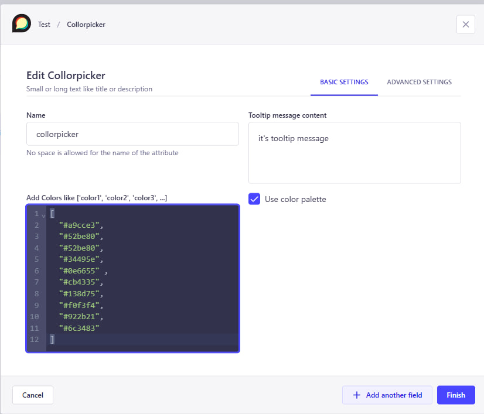

- **Name** – Field label displayed in admin panel  
- **Tooltip Message** – Contextual help shown via tooltip (ℹ️)  
- **Field Description** – Optional short text under the input  
- **Color List** – JSON-style list of `{ name, hex }` entries  
- **Default Value** – Optional default color (can be name or hex)  
- **Enable Color Picker** – Toggle to allow manual hex color picking

---

#### 🧠 Advanced Settings

Additional settings for validation and behavior:

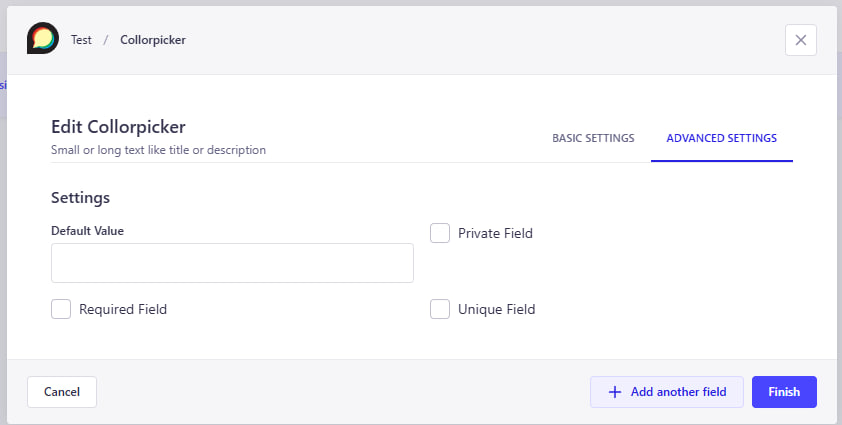

- **Private Field** – Will not be returned in the API  
- **Required Field** – Must be selected before saving  
- **Unique Field** – Ensures uniqueness across all entries  

---

#### ✅ How It Looks

Here’s how the field appears inside the Content Manager:

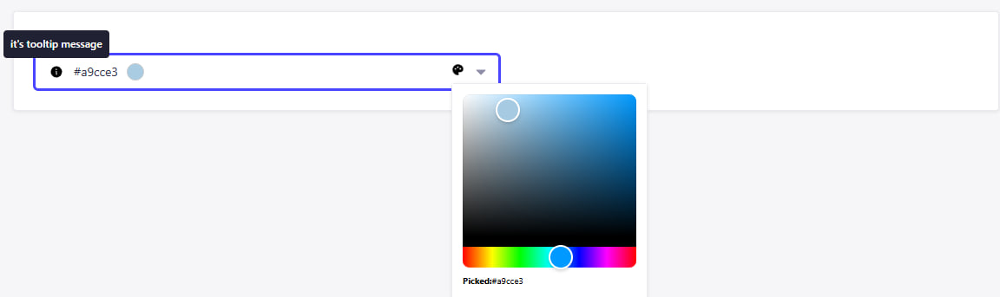

Features include:

- Tooltip help via icon  
- Predefined colors with visual swatch and name  
- Optional hex input via color picker  
- Default color pre-selected (if configured)

---

#### 🤔 Why Use Tooltip Color Picker Field?

This field is a great fit for:

- Selecting theme or status colors consistently  
- Reducing input errors by limiting color choices  
- Letting editors quickly recognize colors visually  
- Offering flexibility via optional hex picker

## Planned custom fields

- ⚪ Tooltiped primitive fields (text, number, boolean) -- To add the description and the
- ⚪ Responsive values -- Allow adding 3 or 5 values for the same input field (base, md, lg) or (base, sm, md, lg, xl). Intended to be used in UI to define the response values.
- ⚪ Color input -- Allow selecting the color from the given list of named color -> hex code enum. Displays the color itself in input in content-editor. Can work in 2 modes: With pre-defined colors list, or with color picker

Feel free to open issues in github to suggest new custom fields

## Issues

All general issues should be submitted through the [Github issue system]
Security issues should be reported using the [security tab]
